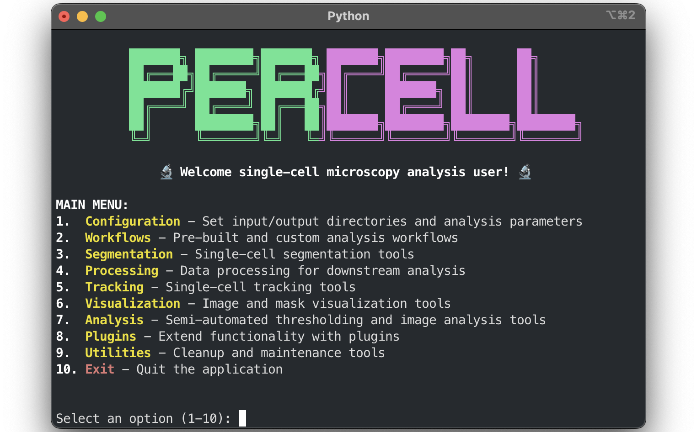

# <p>  <b>PerCell </b> </p>


## Call Graphs (Pyan3)

Generate call graphs for the codebase (DOT and SVG) using Pyan3.

Prerequisites:
- Activate the project's virtual environment: `source venv/bin/activate`
- Ensure Graphviz is installed (macOS): `brew install graphviz`

Generate graphs:
```bash
bash percell/bash/generate_call_graphs.sh
```

Outputs will be written to:
- `docs/graphs/callgraph_uses.dot` and `docs/graphs/callgraph_uses.svg`
- `docs/graphs/callgraph_defines.dot` and `docs/graphs/callgraph_defines.svg`

Note: The project pins `pyan3<1.2` due to a known CLI incompatibility in 1.2.0.

[](https://www.python.org/downloads/)
[](https://github.com/marcusjoshm/percell/)
[](https://github.com/marcusjoshm/percell/blob/main/LICENSE)
[](https://github.com/marcusjoshm/percell/graphs/contributors)
[](https://github.com/marcusjoshm/percell/)
[](https://github.com/marcusjoshm/percell/issues)
[](https://github.com/marcusjoshm/percell/pulls)
[](https://github.com/marcusjoshm/percell/)
[](https://github.com/marcusjoshm/percell/)

A single cell microscopy analysis tool that integrates single cell segmentation using cellpose with imageJ macros into a single software package with an easy-to-use command line interface

## Table of Contents

1. [Installation](#installation)
2. [Getting Started](#getting-started)
3. [Modular CLI System (New!)](#modular-cli-system-new)
4. [Step 1: Remove Spaces from File Names](#step-1-remove-spaces-from-file-names)
5. [Step 2: Activate the Python Environment](#step-2-activate-the-python-environment)
6. [Step 3: Run the Analysis Workflow](#step-3-run-the-analysis-workflow)
7. [Step 4: Data Analysis Selection](#step-4-data-analysis-selection)
8. [Step 5: Cellpose Segmentation](#step-5-cellpose-segmentation)
9. [Step 6: Otsu Thresholding](#step-6-otsu-thresholding)
10. [Tips and Tricks](#tips-and-tricks)
11. [Troubleshooting](#troubleshooting)
12. [Technical Documentation](#technical-documentation)


## Installation

### Quick Installation (Recommended)

After cloning this repository, run a single command to complete the installation:

```bash
# Clone the repository
git clone https://github.com/marcusjoshm/percell.git
cd percell

# Run the installation script (choose one method)
./install
```

This single command will:
- ✅ Create virtual environments (main + Cellpose)
- ✅ Install all dependencies
- ✅ Install the package in development mode
- ✅ Detect software paths (ImageJ/Fiji)
- ✅ Create configuration files
- ✅ Verify the installation

### After Installation

Once the installation is complete, you can use the tool:

```bash
# Option 1: Run from anywhere (recommended)
percell

# Option 2: Run from project directory with activated environment
cd ~/percell
source venv/bin/activate
percell
```

**Global Installation Benefits:**
- ✅ Run `percell` from any directory
- ✅ No need to navigate to project folder
- ✅ No need to activate virtual environment manually
- ✅ Works seamlessly across different terminals

**Why development mode?**
- ✅ Changes to code are immediately reflected (no reinstall needed)
- ✅ Command-line tool available: `percell`
- ✅ Proper package imports work
- ✅ Ideal for development and testing

### Troubleshooting Global Installation

If the `percell` command is not found globally after installation:

```bash
# Quick fix - run this script from the project directory
./percell/setup/fix_global_install.sh

# Or manually create the symlink (replace with your actual path)
sudo ln -sf /path/to/your/percell/venv/bin/percell /usr/local/bin/percell
```

**Common Issue**: The package is installed in the virtual environment but the global symbolic link wasn't created. This happens when:
- You ran `pip install -e .` manually instead of using the installation script
- The installation script didn't have permission to create the symlink
- The symlink was accidentally removed

**Symptoms**:
- `which percell` returns nothing
- `percell --help` says "command not found"
- You have to navigate to the project directory and activate the venv to use percell

**Solution**: Run the fix script from the project root directory. It will automatically detect your setup and create the necessary symlink.

```bash
# From the project root directory (recommended)
./percell/setup/fix_global_install.sh

# Or from anywhere, specifying the full path
/path/to/percell/percell/setup/fix_global_install.sh
```

**Note**: The fix script is self-contained and will automatically find the correct paths regardless of where you run it from.

## Getting Started

### Input Directory Structure

The workflow requires a specific directory structure to organize your microscopy data. Your input directory should be organized hierarchically as follows:

```
input_directory/
├── condition_1/
│   ├── timepoint_1/
│   │   ├── region_1/
│   │   │   ├── channel_1.tif
│   │   │   ├── channel_2.tif
│   │   │   └── channel_3.tif
│   │   └── region_2/
│   │       ├── channel_1.tif
│   │       ├── channel_2.tif
│   │       └── channel_3.tif
│   └── timepoint_2/
│       ├── region_1/
│       │   ├── channel_1.tif
│       │   ├── channel_2.tif
│       │   └── channel_3.tif
│       └── region_2/
│           ├── channel_1.tif
│           ├── channel_2.tif
│           └── channel_3.tif
└── condition_2/
    ├── timepoint_1/
    │   └── region_1/
    │       ├── channel_1.tif
    │       ├── channel_2.tif
    │       └── channel_3.tif
    └── timepoint_2/
        └── region_1/
            ├── channel_1.tif
            ├── channel_2.tif
            └── channel_3.tif
```

#### Directory Structure Requirements:

**For Multi-timepoint Experiments:**
1. **Conditions** (top level): Different experimental conditions (e.g., `Control`, `Treatment`, `Dish_1`, `Dish_2`)
2. **Timepoints** (second level): Time points in your experiment (e.g., `0min`, `30min`, `60min`, `T1`, `T2`)
3. **Regions** (third level): Different regions or fields of view (e.g., `Region_1`, `Field_1`, `ROI_1`)
4. **Channels** (files): Individual channel images as `.tif` files

**For Single-timepoint Experiments:**
1. **Conditions** (top level): Different experimental conditions (e.g., `Control`, `Treatment`, `Dish_1`, `Dish_2`)
2. **Regions** (second level): Different regions or fields of view (e.g., `Region_1`, `Field_1`, `ROI_1`)
3. **Channels** (files): Individual channel images as `.tif` files

*Note: For single-timepoint experiments, the timepoint level is automatically filled in by the workflow.*

#### File Naming Requirements:

- **No spaces** in directory or file names (use underscores `_` instead)
- **No special characters** like `+`, `&`, `%`, etc.
- **Consistent naming** across conditions, timepoints, and regions
- **Channel files** should be named descriptively (e.g., `DAPI.tif`, `GFP.tif`, `RFP.tif`)

#### Example Structures:

**Multi-timepoint Experiment:**
```
microscopy_data/
├── Control/
│   ├── 0min/
│   │   ├── Region_1/
│   │   │   ├── DAPI.tif
│   │   │   ├── GFP.tif
│   │   │   └── RFP.tif
│   │   └── Region_2/
│   │       ├── DAPI.tif
│   │       ├── GFP.tif
│   │       └── RFP.tif
│   └── 30min/
│       └── Region_1/
│           ├── DAPI.tif
│           ├── GFP.tif
│           └── RFP.tif
└── Treatment/
    ├── 0min/
    │   └── Region_1/
    │       ├── DAPI.tif
    │       ├── GFP.tif
    │       └── RFP.tif
    └── 30min/
        └── Region_1/
            ├── DAPI.tif
            ├── GFP.tif
            └── RFP.tif
```

**Single-timepoint Experiment:**
```
microscopy_data/
├── Control/
│   ├── Region_1/
│   │   ├── DAPI.tif
│   │   ├── GFP.tif
│   │   └── RFP.tif
│   └── Region_2/
│       ├── DAPI.tif
│       ├── GFP.tif
│       └── RFP.tif
└── Treatment/
    └── Region_1/
        ├── DAPI.tif
        ├── GFP.tif
        └── RFP.tif
```

> **Important:** 
> - Avoid using a `+` when naming files or directories
> - Ensure all conditions have the same timepoints and regions for consistent analysis
> - Use descriptive names for channels to identify them during analysis
> 
## Modular CLI System (New!)

We've introduced a new modular command-line interface that provides a more user-friendly experience. This system allows you to run individual workflow steps or the complete pipeline with an interactive menu.

### Quick Start with Modular CLI

**After running `python percell/setup/install.py`, you can use the tool**

```bash
# Enter this command in a terminal window. It will work from any working directory.
percell

```


**You'll see the colorful ASCII header and interactive menu:**
      ```
    
     ███████╗ ████████╗███████╗ ███████╗████████╗██╗      ██╗
     ██╔═══██╗██╔═════╝██╔═══██╗██╔════╝██╔═════╝██║      ██║
     ███████╔╝███████╗ ███████╔╝██║     ███████╗ ██║      ██║
     ██╔════╝ ██╔════╝ ██╔═══██╗██║     ██╔════╝ ██║      ██║
     ██║      ████████╗██║   ██║███████╗████████╗████████╗████████╗
     ╚═╝      ╚═══════╝╚═╝   ╚═╝╚══════╝╚═══════╝╚═══════╝╚═══════╝

   🔬 Welcome single-cell microscopy analysis user! 🔬

   MENU:
   1. Set Input/Output Directories
   2. Run Complete Workflow
   3. Data Selection (conditions, regions, timepoints, channels)
   4. Single-cell Segmentation (Cellpose)
   5. Process Single-cell Data (tracking, resizing, extraction, grouping)
   6. Threshold Grouped Cells (interactive ImageJ thresholding)
   7. Measure Cell Area (measure areas from single-cell ROIs)
   8. Analysis (combine masks, create cell masks, export results)
   9. Exit
   Select an option (1-9):
   ```


### Menu Options Explained

#### Option 1: Set Input/Output Directories
- Updates the configuration file with your input and output paths
- Does not create any directories (only updates config)
- Use this to set up your paths before running other options

#### Option 2: Run Complete Workflow ⭐ **Recommended for New Users**
- Runs all steps in sequence: 3 → 4 → 5 → 6 → 7
- Handles interactive steps automatically
- Perfect for running the entire analysis pipeline

#### Option 3: Data Selection
- Interactive selection of conditions, regions, timepoints, and channels
- Creates the output directory structure
- Prepares input data for analysis
- **Required before running other workflow steps**

#### Option 4: Single-cell Segmentation
- Bins images for segmentation
- Launches Cellpose and FIJI for interactive cell segmentation
- **Requires data selection to be completed first**

#### Option 5: Process Single-cell Data
- Tracks ROIs across timepoints (if multiple timepoints)
- Resizes ROIs to match original image dimensions
- Duplicates ROIs for analysis channels
- Extracts individual cells
- **Requires data selection to be completed first**

#### Option 6: Threshold Grouped Cells
- Groups cells by expression level
- Interactive ImageJ thresholding for grouped cells
- **Requires data selection to be completed first**

#### Option 7: Analysis
- Combines masks from different groups
- Creates individual cell masks
- Analyzes cell features
- Includes group metadata in results
- **Requires data selection to be completed first**

### Example Workflow

**For a complete analysis:**
1. Choose Option 2 (Run Complete Workflow)
2. Follow the prompts for data selection
3. Complete the interactive segmentation step
4. Wait for all processing to complete

**For step-by-step analysis:**
1. Choose Option 1 to set directories
2. Choose Option 3 for data selection
3. Choose Option 4 for segmentation
4. Choose Option 5 for cell processing
5. Choose Option 6 for thresholding
6. Choose Option 7 for analysis

### Benefits of the Modular System

- **User-friendly**: Clear menu with color-coded options
- **Flexible**: Run individual steps or complete workflow
- **Error recovery**: Returns to menu after errors
- **Progress tracking**: Shows which step is currently running
- **Interactive support**: Proper handling of user input

### Opening Terminal

1. Press Command + Space to open Spotlight Search
2. Type "Terminal"
3. Click on the Terminal application

Alternatively you can click on the Terminal app icon located in the doc at the bottom of the screen. It looks like a black square with >_ in the top left corner.

When Terminal opens, you'll see a prompt that looks something like `(base) ➜  ~`


## Step 1: Remove Spaces from File Names

Our analysis workflow requires file paths without spaces. Follow these steps to convert spaces in your file names to underscores:

1. Copy and paste the following command into Terminal:

```bash
cd ~/bash_scripts/
```

3. Press `Enter`.

2. Next, copy and paste this command:

```bash
./replace_spaces.sh
```

3. Drag the folder you want to analyze from Finder into the Terminal window. The file path will appear automatically.

4. Press `Enter`.

5. You will see a prompt that looks like this:

```
========================================================
  Space to Underscore Converter - Enhanced Version
========================================================
```

Followed by information about the directory you want to modify.

6. At the end, you will see:

```
Do you want to continue? (y/n)
```

7. Type `y` and press Enter to run the program.

8. When the process completes successfully, you will see:

```
[SUCCESS] Operation completed successfully!
```

This means the program has finished removing spaces from all file names in the directory and you're ready to proceed to the analysis workflow.

## Step 2: Activate the Python Environment

In the same Terminal window:

1. Copy and paste the following commands:

```bash
cd ~/percell
venvact
```

2. Press `Enter`.

3. You should now see `(venv)` at the beginning of the command prompt line. This indicates that the Python virtual environment is activated and the program is ready to run.

Example of how your prompt should look:
```bash
(venv) (base) ➜  percell git:(main) ✗
```

## Step 3: Run the Analysis Workflow

You have two options for running the analysis workflow:

### Option A: New Modular CLI (Recommended) ⭐

1. **Run the modular interface**:
   ```bash
   python main.py
   ```

2. **Choose Option 2 (Run Complete Workflow)** from the menu

3. **Follow the interactive prompts** for data selection and segmentation

This is the recommended approach for new users as it provides a more user-friendly experience.

### Option B: Original Workflow

If you prefer the original command-line approach:

1. Copy and paste the following into Terminal:

```bash
python single_cell_workflow.py --config config/config.json
```

2. After pasting the above, press Space and type `--input` followed by another Space.

3. Drag the folder you want to analyze from Finder into the Terminal window. The absolute file path will appear.

4. Press Space and type `--output` followed by another Space.

5. Drag the same folder into Terminal again.

6. After the path appears, add `_analysis` followed by a description at the end of the folder name. Make sure there are no spaces in the file path.

Your final command should look something like this:
```bash
python single_cell_workflow.py --config config/config.json --input /Volumes/LEELAB/JL_Data/2025-05-08_export_max --output /Volumes/LEELAB/JL_Data/2025-05-08_analysis_Dish_1_Control_40minWash
```

7. Press `Enter` to start the analysis.

8. The script will create an output folder with the name you specified, containing all analysis results.

> **Important:** Remember that the output folder name can be anything you want as long as there are no spaces in it. Use underscores (_) instead of spaces.

## Step 4: Data Analysis Selection

After starting the analysis workflow, you'll need to make selections about your data:

### Selecting Data Type

The program will prompt you to select the type of data you're analyzing:

```
================================================================================
MANUAL STEP REQUIRED: select_datatype
================================================================================
Select the type of data: single_timepoint or multi_timepoint. You can specify the datatype when running the script with the --datatype option.

Detected datatype based on found timepoints: single_timepoint
Select data type:
1. single_timepoint
2. multi_timepoint
Enter selection (number or name, press Enter for detected default):
```

**Important:** 
- Choose `single_timepoint` (option 1) for immunofluorescence or single time-point live microscopy
- Choose `multi_timepoint` (option 2) for time-lapse microscopy data only

Make your selection by typing "1" or "2" followed by Enter. If the detected default is correct, you can simply press Enter.

### Selecting Condition

Next, you'll see a prompt to select the experimental condition for analysis:

```
================================================================================
MANUAL STEP REQUIRED: select_condition
================================================================================
```

"Condition" in this case will be the name of the .lif project file where data was exported. If you exported data from multiple project files, there will be a list of conditions to choose from, otherwise there will only be one. An example of a condition list looks something like this:

```
Available conditions:
1. Dish_1_Sec61b_Washout_+_DMSO
2. Dish_2_Sec61b_Washout_+_Rapa
3. Dish_3_RTN4_Washout_+_DMSO
4. Dish_4_RTN4_Washout_+_Rapa
5. Dish_5_CLIMP63_Washout_+_DMSO
6. Dish_6_CLIMP63_Washout_+_Rapa

Input options for conditions:
- Enter conditions as space-separated text (e.g., 'Dish_1_Sec61b_Washout_+_DMSO Dish_6_CLIMP63_Washout_+_Rapa')
- Enter numbers from the list (e.g., '1 6')
- Type 'all' to select all conditions

Enter your selection:
```

Type the number of the project file you would like to analyze. If you want to analyze multiple condition datasets at the same time, type the numbers separated by a space, or type "all" if you want to analyze everything. Then press `Enter`.

### Selecting Timepoints

Next, you'll see a prompt to select timepoints for analysis:

```
