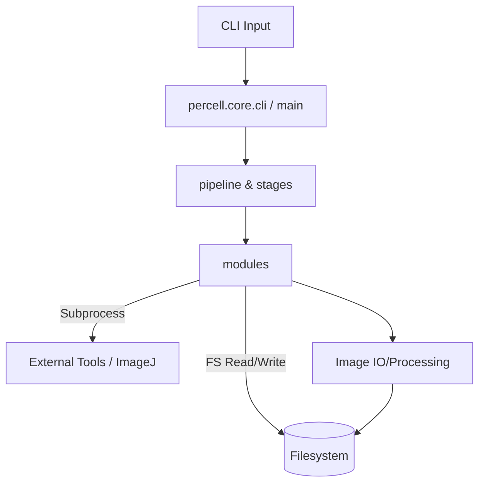

# Data Flow Analysis (main branch)

Source: main branch at commit 925cee92e220a947ff10ce15415e2957f4812430

## Inbound

- CLI: `percell.main.main`, `percell.core.cli`, module scripts (`argparse`).

## Processing

- Orchestration: `percell.core.pipeline` and `percell.core.stages` coordinate steps.
- Modules execute ImageJ macros and Python scripts via `subprocess`.
- Image processing via numpy, OpenCV, skimage; metadata aggregation via pandas.

## Outbound

- Filesystem writes: TIFFs, CSVs, logs, summaries.
- Subprocess calls to external tools (ImageJ, cellpose env).

## External Touchpoints

- No persistent DB or HTTP services detected.
- Heavy reliance on local filesystem and OS processes.

## Diagram (Mermaid)

