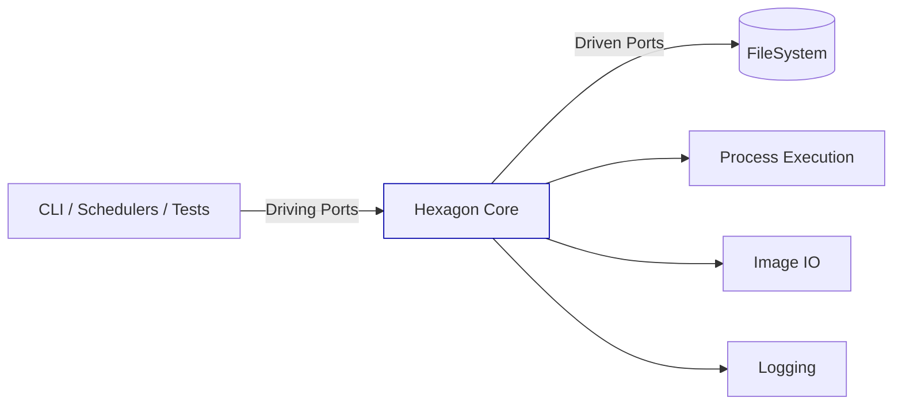

# Ports & Adapters Design (target state, based on main branch analysis)

Source analyzed: main branch at commit 925cee92e220a947ff10ce15415e2957f4812430

## Driving Ports (Inbound)
- WebPort: (future) for HTTP endpoints if added
- CommandPort: encapsulate CLI command parsing and invocation
- ScheduledTaskPort: cron/batch workflows
- TestingPort: fixtures and scenario drivers

## Driven Ports (Outbound)
- PersistencePort: (placeholder) if persistence introduced later
- ExternalServicePort: (placeholder) for HTTP APIs if added
- FileSystemPort: abstract FS access (read/write/list)
- ProcessExecutionPort: abstract subprocess execution
- ImageIOPort: abstract image read/write/transform
- NotificationPort: (optional) for user notifications/logging hooks

## Adapters (Initial)
- CLI Adapter: current argparse code becomes adapter for CommandPort
- FS Adapter: uses `pathlib`, `glob`, `shutil`
- Process Adapter: wraps `subprocess` calls
- ImageIO Adapter: wraps numpy/cv2/skimage operations
- Logger Adapter: current logger becomes adapter for LoggingPort

## Hexagon Core
- Domain Models: dataset, stage, pipeline configuration
- Use Cases: run pipeline, prepare directories, execute analysis stage
- Policies: stage sequencing, error handling rules

## Diagram (Mermaid)

## Notes
- Keep core free of `subprocess`, `pathlib`, `cv2`, `pandas` imports.
- All side effects go through ports, injected into use cases.
